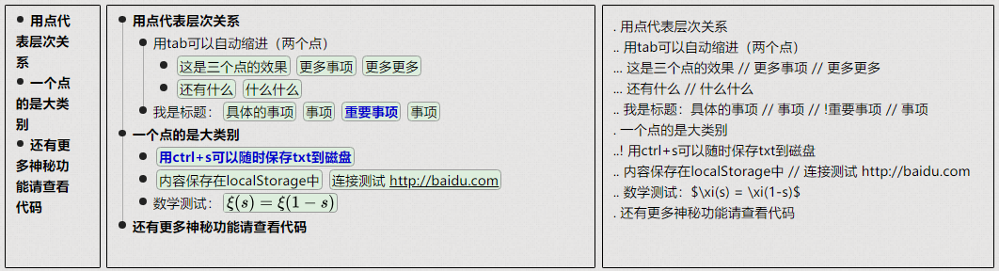
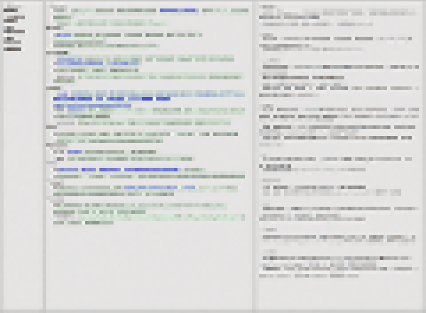

# BlinkToDo
如果你的ToDo有一百项以上，试试这个基于txt的轻量级事项管理工具。

效果如图：

事项更多的时候的效果：

测试代码：
. 用点代表层次关系
.. 用tab可以自动缩进（两个点）
... 这是三个点的效果 // 更多事项 // 更多更多
... 还有什么 // 什么什么
.. 我是标题：具体的事项 // 事项 // !重要事项 // 事项
. 一个点的是大类别
..! 用ctrl+s可以随时保存txt到磁盘
.. 内容保存在localStorage中 // 连接测试 http://baidu.com
.. 数学测试：$\xi(s) = \xi(1-s)$
. 还有更多神秘功能请查看代码
